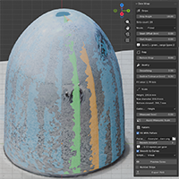
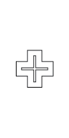
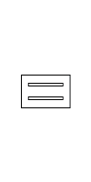
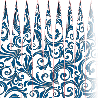

# Gore Wrap



A Blender extension that simplifies a scanned mesh into flat **gore strips** —
vertical panels that taper to a point at the top — and exports a real-scale SVG
for cutting on a CNC or desktop cutter for wrapping around the scanned object.

An optional SVG pattern can be included and a separate pattern object will be mapped onto the gores such that the pattern will line up when wrapped.

Originally built for transferring complex patterns onto glass stuff-cups.

## Install

### From Blender Marketplace

TBD.

###  From Source
1. Build the extension zip into the `dist/` directory (pick one):
   - If you have make and Python installed:
      ```
      make
      ```
      The Makefile finds Blender on `PATH` or in the usual macOS / Linux /
      Windows install locations; override it with `make BLENDER=/path/to/blender`
      (`make blender-path` shows which one it picked).

   - _**-OR-**_ By hand with only blender installed:
      ```
      mkdir -p dist
      <path-to-blender>/blender --factory-startup --command extension build \
          --source-dir . --output-dir dist
      ```
      `--factory-startup` builds with none of your add-ons or preferences
      loaded, so the zip cannot depend on local configuration; it has to come
      before `--command`, which swallows every argument after it.
2. In Blender: **Edit → Preferences → Get Extensions → ▾ → Install from Disk…**
   and pick the zip. Works on Blender 4.2+ (tested on 4.5 LTS and 5.0).

## Use

1. Orient the scan **Z-up**, centered on the **X** & **Y** axes and delete
   obvious base junk.
2. Open the **Gore Wrap** tab in the 3D viewport sidebar (`N`).
3. Set the strip geometry in the **Strips** panel:
   - **Strip Angle** — the target angular width of one gore (24° → 15 strips,
     18° → 20 strips, etc.). The **strip count** below it is what that angle
     snapped to, since only a whole number of strips fits around the object.
   - **Seam Offset** — edge allowance in mm: positive overlaps the neighboring
     strip, negative leaves a gap, zero is a butt joint.
4. Choose the **Mode**:
   - **Averaged** — one averaged gore shape is repeated for every strip. The
     strips are interchangeable, so they can go on in any order, anywhere.
   - **Fitted** — each gore is fitted to its own angular sector of the scan, so
     it tracks local bumps and dents. The strips all differ, so they have to be
     applied in order at the right place. Choosing it adds two things:
     - **Start Angle** — which sector becomes gore 1 (degrees counter-clockwise
       from +X seen from above), so you can line gore 1 up with a landmark on
       the object.
     - a reminder that **gore 1 is green and gore 2 is orange** in the Preview
       — the two colors give you the starting strip and the direction to wind
       in. See [Fitted mode: where to start
       applying](#fitted-mode-where-to-start-applying) below.
5. Trim the base and preview:
   - **Bottom Crop** — discard everything below this height.
   - **Preview** — draws a semi-transparent reconstructed surface over the scan
     and fills the **Scale** panel with height / max diameter / bottom
     circumference and a fit-error. This step is optional, but quite helpful for
     Fitted Mode cuts.
6. **Calibrate** to override the dimensions found in the scanned mesh:
   - Measure one real dimension on the object.
   - Pick which dimension it is under *Calibrate By*.
   - Enter it as *Measured Value*, then click *Apply Measured Scale*.
7. Click **Export SVG** and open the file in you editor / controller of choice.
   Strips are laid out on a common baseline in wrap order.
   - **Number Strips** (on by default) — writes a separate red `labels` layer
     numbering the strips in wrap order; exclude that layer from cutting.
     Uncheck it for an outline-only file. Fitted mode only, since Averaged
     strips are identical and need no numbering.
8. To apply a repeating design, check **Fill With Pattern**. The pattern is
   warped to each gore — squeezed horizontally so it fills the taper without
   distorting vertically — and written as a separate `pattern` layer.
   - **Pattern SVG** — a seamless (tileable) SVG; export EPS to SVG from your
     vector editor first.
   - **Repeats Around** — how many times the pattern tiles around the object.
   - **Smooth to Curves** — fit the warped pattern to smooth bezier curves so
     the cutter does not stutter through many tiny line segments.
   - **Simplify Mode** — with **Smooth to Curves** on, how aggressively to fit:
     - **Visual** (default) — fewest nodes and the smoothest cut, while keeping
       genuine corners crisp.
     - **Cutter Resolution** — hugs the true warped shape to cutter precision;
       more nodes, use it when exact fidelity matters.
     - **Custom** — reveals **Simplify Tol (mm)** (max deviation of the fitted
       curves from the true shape) and **Corner Angle (deg)**.

         The **Corner Angle** is the *turn* angle — how far the path bends at a
         join. A join is kept as a sharp corner only when it turns by more than
         this; gentler bends are smoothed into one curve, so a **lower** value
         smooths more. Note this is the opposite sense from some vector editors,
         whose "corner angle threshold" measures the *interior* angle (180° −
         turn): their 150° default corresponds to about 30° here.

         Some vector editors simplify with a *curve-precision percentage*
         instead of a distance. That runs the opposite way — a higher percentage
         keeps the path *closer* to the original (less simplification) — and it
         is a relative setting with no real-world unit, so the same percentage
         deviates by different amounts on different artwork. **Simplify Tol** is
         an absolute limit in millimeters, so it stays predictable at cut scale
         regardless of the pattern's size.

### Fitted mode: where to start applying

Fitted strips are sector-specific, so they must go on in order at the right
place. Mark a landmark on the object (a seam, a blemish, a dab of tape), then
set **Start Angle** so gore 1 lands on it — in the Preview, **gore 1 is green**
and **gore 2 is orange**. Apply the green strip (label 1) at your landmark, then
continue toward the orange strip (winding counter-clockwise seen from the top)
with strips 2, 3, …. Each gore is left-right symmetric, so you never need to
flip one; only the start and direction matter. (Averaged mode gores are
identical, so none of this applies — start anywhere.)

## Development

Geometry, layout, pattern warping, and SVG writing are pure
numpy/svgelements/stdlib and tested without Blender. Requires Python 3.11+
(the test suite reads `blender_manifest.toml` with `tomllib`):

```
python -m venv .venv && .venv/bin/pip install -r requirements.txt
.venv/bin/python -m pytest
```

`requirements.txt` pins numpy to the version Blender bundles and svgelements to
the wheel in `wheels/`, so the headless suite runs against the same libraries
the add-on gets inside Blender. The pin tracks 4.5 LTS; the file lists what
every supported Blender ships, and CI runs the suite against each.

End-to-end smoke test inside Blender:

```
blender --background --factory-startup --python-exit-code 1 \
    --python tests/blender_smoke.py
```

`--factory-startup` skips this machine's installed copy of the add-on so the
checkout copy being tested doesn't collide with it; `--python-exit-code 1`
makes Blender itself fail if the script does, as a second line of defense
behind the script's own exit code.

Module map: `geometry.py` (primitives), `pipeline.py` (orchestration),
`svg_export.py` (mat layout + SVG), and the bpy shell
(`properties/operators/ui/registry/__init__`). See
`docs/superpowers/specs/2026-07-05-gore-wrap-design.md` for the full design.

The extension's `__init__.py` and `blender_manifest.toml` live at the repo
root, so the repo root is the package. Adding a module means adding it to
`[build].paths` in `blender_manifest.toml` — `tests/test_manifest.py` fails
if you forget.

### CI

`.github/workflows/ci.yml` runs on every push and pull request: the `pytest`
suite once per supported Blender, on the Python and numpy that Blender bundles
(4.2 → 3.11 + numpy 1.24, 4.5 LTS → 3.11 + numpy 1.26, 5.2 → 3.13 + numpy 2.3,
so both sides of the numpy 2.0 break stay covered); the in-Blender smoke test
on those same three; and a build of the extension zip. Each Blender series
resolves to its newest patch release at run time and is cached, so a new 4.5.x
needs no edit.

### Releasing

1. Bump `version` in `blender_manifest.toml` and commit.
2. Tag it and push: `git tag v0.7.2 && git push origin v0.7.2`.

`.github/workflows/release.yml` then checks the tag against the manifest
version, runs the full CI suite, and publishes a GitHub release with
auto-generated notes and the zip CI built attached. A tag that disagrees with
the manifest fails before anything is published.

## Credits

The floral pattern shown above is
[Background pattern seamless texture illustration leaf black print vector floral](https://www.vecteezy.com/vector-art/7892500-background-pattern-seamless-texture-illustration-leaf-black-print-vector-floral)
by Bambang Ratu Wibowo, via Vecteezy.
